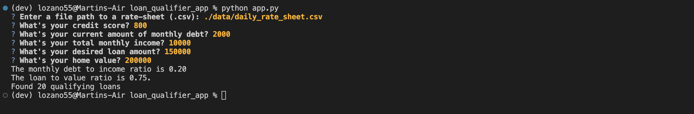

# Loan Qualifier Application

This is an Interactive application via Command line.
That allows a User to dinamically input basic financial information and compare it to a list of lenders, and see the eligibility of a home loan. A List is then Produced providing the User the qualifying loans. 

&nbsp; 

---


## Technologies
&nbsp;

Program Language: Python 3.7+

Dependencies:
* Python Fire.
    * Python Fire allows the User to Generate a Command Line Interface(CLI)
    * Reference.[README.md](https://github.com/google/python-fire) 
* Python Questionary.
    * Python Questionary allows the User to Interact with the Command Line Interface (CLI)
    * Reference.[README.md](https://github.com/tmbo/questionary)

&nbsp;


---

## Installation Guide
&nbsp;

Before Installation, Via command line, Terminal(MacOS) or Command shell/PowerShell(Windowns),  activate a dev environment, by typing conda activate dev.

You should now see (dev) Displayed in your command line
```
(base) user@user-Air ~% conda activate dev
(dev) user@user-Air ~%
```

&nbsp;

Now To Install the Dependencies Input These Commands into your command line
* To Install Fire:
    ```Python
    pip install fire
    ```

* To Install Questionary:
    ```python 
    pip install questionary
    ```
&nbsp;

---

## Usage
&nbsp;
 
1. Via Terminal(MacOS) or Command shell/PowerShell(Windowns). Type: `python app.py`

2. Input a file or file path of the list of loans (.csv)

3. User can now dinamically input basic financial information and compare it to the list of loans, and see the eligibility of a home loan.
4. Finally the Application will Produce the List of loans that the User Qualified for 

&nbsp;


&nbsp;

---
  
## Contributors

Martin Lozano

&nbsp;

---

## License

&nbsp;

--- 

## Code Obtained 

`&nbsp;` Code was obtained via [stack overflow](https://stackoverflow.com/questions/15721373/how-do-i-ensure-that-whitespace-is-preserved-in-markdown) to create spaces in MarkDown file

&nbsp;

---

## Additional Functions added

```python 
def save_csv(csvpath, qualifying_loans):
    with open(csvpath, "w", newline="") as csvfile:
        csvwriter = csv.writer(csvfile, delimiter=",")

        for data in qualifying_loans:
            csvwriter.writerow(data)
```