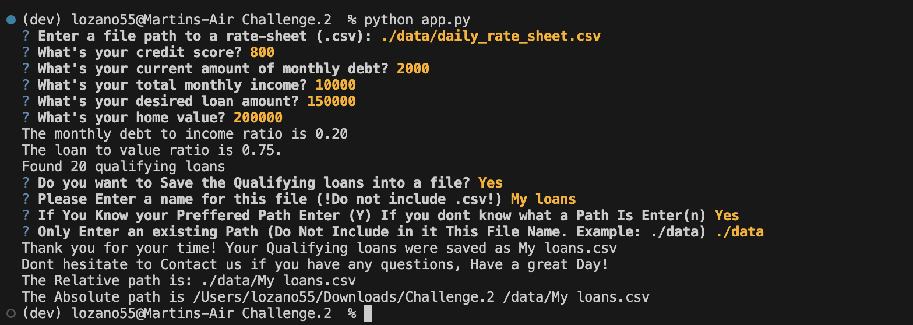

# Loan Qualifier Application

This is an Interactive application via Command line.
That allows a User to dinamically input basic financial information and compare it to a list of lenders, and see the eligibility of a home loan. A List is then Produced providing the User the qualifying loans. 

&nbsp; 

---


## Technologies
&nbsp;

Program Language: Python 3.7+

Dependencies:
* Python Fire.
    * Python Fire allows the User to Generate a Command Line Interface(CLI)
    * Reference.[README.md](https://github.com/google/python-fire) 
* Python Questionary.
    * Python Questionary allows the User to Interact with the Command Line Interface (CLI)
    * Reference.[README.md](https://github.com/tmbo/questionary)

&nbsp;


---

## Installation Guide
&nbsp;

Before Installation, Via command line, Terminal(MacOS) or Command shell/PowerShell(Windowns),  activate a dev environment, by typing conda activate dev.

You should now see (dev) Displayed in your command line
```
(base) user@user-Air ~% conda activate dev
(dev) user@user-Air ~%
```

&nbsp;

Now To Install the Dependencies Input These Commands into your command line
* To Install Fire:
    ```Python
    pip install fire
    ```

* To Install Questionary:
    ```python 
    pip install questionary
    ```
&nbsp;

---

## Usage
&nbsp;
 
1. Via Terminal(MacOS) or Command shell/PowerShell(Windowns). Type: `python app.py`

2. Input a file or file path of the list of loans (.csv)

3. User can now dinamically input basic financial information and compare it to the list of loans, and see the eligibility of a home loan.
4. Finally the Application will Produce the List of loans that the User Qualified for 

&nbsp;


&nbsp;

---
  
## Contributors

Martin Lozano

&nbsp;

---

## License

&nbsp;

--- 

## Code Obtained 

`&nbsp;` Code was obtained via [stack overflow](https://stackoverflow.com/questions/15721373/how-do-i-ensure-that-whitespace-is-preserved-in-markdown) to create spaces in MarkDown file

&nbsp;

Understanding code functionality for  [questionary](https://questionary.readthedocs.io/en/stable/pages/types.html#confirmation)

---

## Additional Functions added

1. This Function allows the application to save the eligible loans into a (.csv) file
```python 
def save_csv(csvpath, qualifying_loans):
 
    with open(csvpath, "w", newline="") as csvfile:
        csvwriter = csv.writer(csvfile, delimiter=",")
        
        header = ["Lender","Max Loan Amount","Max Loan to value","Max dept to Income","Minimum Credit Score","Interest Rate "]

        csvwriter.writerow(header)

        for data in qualifying_loans:
            csvwriter.writerow(data)
```
&nbsp;

&nbsp;

2. This is a Highly interactive and User Friendly function that allows the User to choose a few options 

First the CLI asks the User if a Loan File Should Be saved 
>- If the User Choose(n): then no file saves regardless of eligibily on a loan.
>- If the User Choose(Y): But was not eligible for at least 1 loan, then the CLI Automatically exits system and displays message 
>- If the User Choose(Y): and User was eligible for at least 1 loan then, then User will be prompted to Type a name for the file(not including the .csv at the end of the file name)

&nbsp;


The CLI then prompts the User if there is a preffered path to store the file 
>- If the User Choose (n): Then the File is saved to the current folder the User is in, the system Automatically exits, and displays message 
>- if the User Choose (Y): Then The User is will then be prompted to Type in the Path (Not Including the Loan File name just typed (Example: ./data)). This then saves the file into the preffered path and then displays a few helpful messages.

```python
def save_qualifying_loans(qualifying_loans):
  
    save_file = questionary.confirm("Do you want to Save the Qualifying loans into a file?").ask()

    if save_file == True:
            
        if len(qualifying_loans) >= 1:
            file_name = questionary.text("Please Enter a name for this file (!Do not include .csv!)").ask()
            preferred_path = questionary.confirm("If You Know your Preffered Path Enter (Y) If you dont know what a Path Is Enter(n)").ask()


            if preferred_path == False:
                csvpath = (f"{file_name}.csv")

                print(f"Thank you for your time! Your Qualifying loans were saved to your Current Folder as {csvpath}")
                print(f"Dont hesitate to Contact us if you have any questions, Have a great Day!")

                csvpath = Path(csvpath)
                save_csv(csvpath, qualifying_loans)

            elif preferred_path == True:
                enter_path = questionary.text("Only Enter Your Desired Path(Do Not Include in it This File Name (Example ./data)").ask()
                csvpath = (f"{file_name}.csv")
                print(f"Thank you for your time! Your Qualifying loans were saved as {csvpath}")
                print(f"Dont hesitate to Contact us if you have any questions, Have a great Day!")

                csvpath = (f"{enter_path}/{csvpath}")
                print(f"The Relative path is: {csvpath}")
                csvpath = Path(csvpath)
                print(f"The Absolute path is {csvpath.absolute()}")

                save_csv(csvpath, qualifying_loans)

        
        elif len(qualifying_loans) <= 0:
            sys.exit("We are Sorry, It looks like There are currently no eligible Loans to save. Have a Great Day!")

    if save_file == False:
        print("Thank you for your time! Contact us if you have any questions, Have a great Day!")


```
&nbsp;
